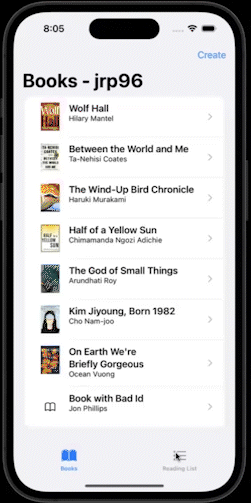

# "Book Manager": An iOS App  

     This is an app that allows you to track your reading list from a pre-populated list of books. To help you decide which books to add to your list, you’ll need to fetch the synopsis for each book from OpenLibrary with an API call. You can also add new books to the list, but you cannot edit them so far (this is a functionality coming soon).

## Features

- [x] Functionality

You have two lists, a list of books and a reading list. When you tap on a book, you can see detail about that book: the book cover, title, author, and the synopsis fetched from OpenLibrary. There is also a button in the upper right corner. If the book is not on the reading list, it says “Add to List”. If the book is on the reading list, it says “Remove from List”. And, clearly, that button adds and removes books on the reading list. You can view the reading list by tapping on its tab button. The books on the reading list are not click-able, but you can swipe them to remove them from the reading list. We saw the swipre-to-delete functionality in lecture 8.

- [x] Feature 2
- [x] Feature 3
- [x] Feature 4
- [x] Feature 5

## Requirements

- iOS 16.0+
- Xcode 14.2

## Installation

